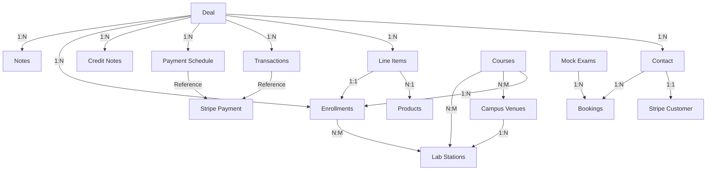
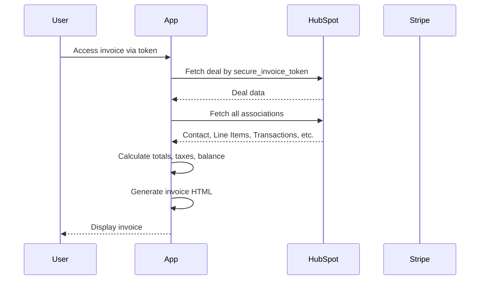
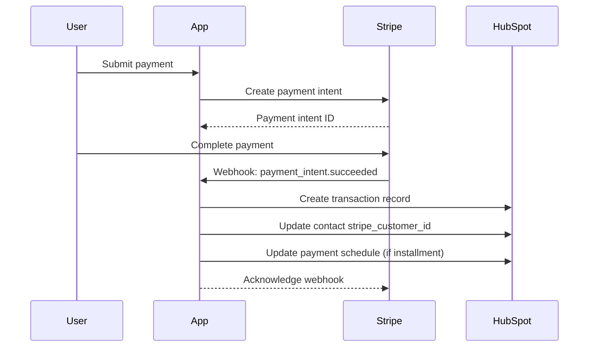
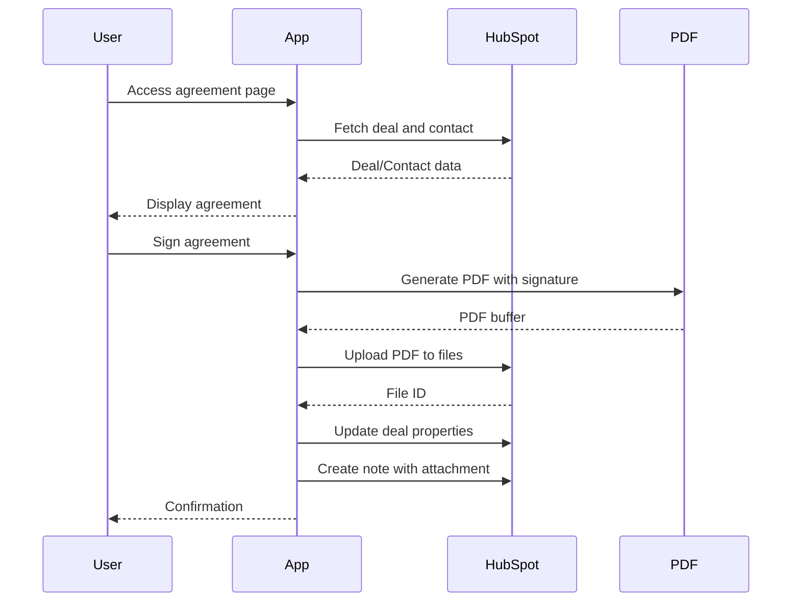
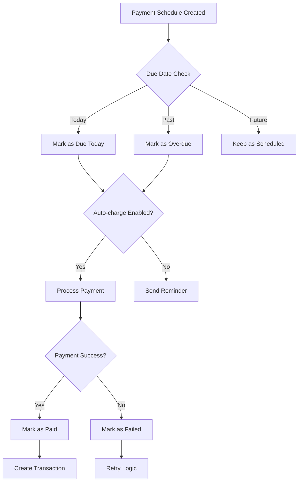

# HubSpot CRM Schema Documentation
## PrepDoctors Automation Framework

### Table of Contents
1. [System Overview](#system-overview)
2. [Deal Object Schema](#deal-object-schema)
3. [Associated Objects](#associated-objects)
4. [Custom Objects](#custom-objects)
5. [Data Relationships](#data-relationships)
6. [API Integration Patterns](#api-integration-patterns)
7. [Business Workflows](#business-workflows)
8. [Security & Access Control](#security--access-control)
9. [Environment Configuration](#environment-configuration)
10. [Code Examples](#code-examples)

---

## System Overview

The application leverages HubSpot CRM as its primary database, implementing a deal-centric architecture for managing course enrollments, student records, and business processes. The system uses custom objects to extend HubSpot's native functionality and integrates with external services as needed.

### Architecture Diagram
```
┌─────────────────────────────────────────────────────────┐
│                    HubSpot CRM                          │
│                                                         │
│  ┌──────────┐     ┌──────────────┐    ┌─────────────┐ │
│  │   Deal   │────▶│   Contact    │    │  Line Items │ │
│  │  Object  │     └──────────────┘    └─────────────┘ │
│  └─────┬────┘                                │         │
│        │                                      ▼         │
│        │         ┌──────────────┐    ┌─────────────┐  │
│        ├────────▶│ Transactions │    │   Products  │  │
│        │         └──────────────┘    └─────────────┘  │
│        │                                               │
│        │         ┌──────────────┐    ┌─────────────┐  │
│        ├────────▶│   Payment    │    │   Credit    │  │
│        │         │  Schedules   │    │    Notes    │  │
│        │         └──────────────┘    └─────────────┘  │
│        │                                               │
│        │         ┌──────────────┐    ┌─────────────┐  │
│        └────────▶│ Enrollments  │    │    Notes    │  │
│                  └──────────────┘    └─────────────┘  │
└─────────────────────────────────────────────────────────┘
                            │
                            ▼
                    ┌──────────────┐
                    │    Stripe    │
                    │   Payments   │
                    └──────────────┘
```
## Relevant Objects

**Schema last verified**: September 16, 2025
**Total properties across all objects**: 1,847

| Object Name | Type ID | Total Properties | Business Properties | Status |
|-------------|---------|------------------|-------------------|---------|
| Contacts | `0-1` | 768 | 20+ | ✅ Active |
| Deals | `0-3` | 601 | 20+ | ✅ Active |
| Courses | `0-410` | 70 | 20+ | ✅ Active |
| Transactions | `2-47045790` | 59 | 20+ | ✅ Active |
| Payment Schedules | `2-47381547` | 57 | 20+ | ✅ Active |
| Credit Notes | `2-41609496` | 54 | 20+ | ✅ Active |
| Enrollments | `2-41701559` | 86 | 20+ | ✅ Active |
| Lab Stations | `2-41603799` | 51 | 20+ | ✅ Active |
| Campus Venues | `2-41607847` | 37 | 7 | ✅ Active |
| Mock Exams | `2-50158913` | 33 | 3 | ✅ Active |
| Bookings | `2-50158943` | 31 | 1 | ✅ Active |


---

## Deal Object Schema

### Standard HubSpot Deal Properties

| Property | Type | Description | Usage |
|----------|------|-------------|-------|
| `dealname` | String | Deal title/name | Display name on invoices |
| `amount` | Number | Total deal value | Base amount for calculations |
| `closedate` | Date | Deal close date | Transaction tracking |
| `createdate` | Date | Deal creation date | Audit trail |
| `hubspot_owner_id` | String | Deal owner ID | Sales rep assignment |
| `dealstage` | String | Current pipeline stage | Workflow tracking |
| `pipeline` | String | Sales pipeline ID | Process routing |
| `deal_currency_code` | String | Currency code (CAD/USD) | Payment processing |

### Custom Deal Properties - Financial

| Property | Type | Description | Example Values |
|----------|------|-------------|----------------|
| `payment_terms` | String | Payment structure type | "Payment Plan", "Full Payment" |
| `allow_partial_payments` | String | Enable partial payments | "true", "false" |
| `total_transactions` | Number | Sum of all transactions | Calculated field |
| `secure_invoice_token` | String | 48-char hex token | "a3f5b8c9d2e1..." |
| `stripe_payment_link` | URL | Payment link | "https://pay.prepdoctors.com/..." |
| `invoice_create_date` | DateTime | Invoice generation timestamp | ISO 8601 format |
| `invoice_notes` | Text | Custom invoice notes | Free text |

### Custom Deal Properties - Agreements

| Property | Type | Description | Validation |
|----------|------|-------------|------------|
| `agreement_typed_name` | String | Name typed for agreement | Must match contact name |
| `agreement_signature` | String | Digital signature | Same as typed name |
| `agreement_timestamp` | DateTime | Signing timestamp | ISO 8601 format |
| `agreement_ip_address` | String | Signer's IP address | IPv4/IPv6 format |
| `agreement_to_auto_charge` | String | Auto-charge consent | "true", "false" |
| `general_enrollment_and_course_agreement` | String | Terms acceptance | "true", "false" |

### Custom Deal Properties - NDA

| Property | Type | Description | Validation |
|----------|------|-------------|------------|
| `non_disclosure_agreement` | Text | NDA content | HTML/Plain text |
| `nda_typed_name` | String | Name typed for NDA | Must match contact name |
| `nda_signature` | String | NDA digital signature | Same as typed name |
| `nda_timestamp` | DateTime | NDA signing timestamp | ISO 8601 format |
| `nda_ip_address` | String | Signer's IP for NDA | IPv4/IPv6 format |

---

## Associated Objects

### Contact Object

**Association Type:** Deal to Contact (Standard)

#### Key Properties Used

| Property | Type | Description | Required |
|----------|------|-------------|----------|
| `firstname` | String | Contact first name | Yes |
| `lastname` | String | Contact last name | Yes |
| `email` | Email | Primary email | Yes |
| `phone` | String | Phone number | No |
| `address` | String | Street address | No |
| `city` | String | City | No |
| `state` | String | Province/State | No |
| `zip` | String | Postal code | No |
| `country` | String | Country | No |
| `student_id` | String | Student identifier | No |
| `stripe_customer_id` | String | Stripe customer reference | Auto-generated |
| `lifecyclestage` | String | Contact stage | Default: "lead" |
| `shared_mock_credits` | Number | Tokens used for booking Clinical Skills Mocks Exam or Situational Judgment Mock Exams
| `cs_credits` | Number | Tokens used for booking Clinical Skills Mocks Exam
| `sj_credits` | Number | Tokens used for booking Situational Judgment Mock Exams
| `sjmini_credits` | Number | Tokens used for booking Mini-mock Mock Exams


#### Contact Creation Pattern
```javascript
{
  properties: {
    firstname: "John",
    lastname: "Doe",
    email: "john.doe@example.com",
    phone: "416-555-0123",
    student_id: "STU-2024-001",
    lifecyclestage: "lead"
  }
}
```

### Line Items Object

**Association Type:** Deal to Line Items (Standard)

#### Properties

| Property | Type | Description | Example |
|----------|------|-------------|---------|
| `name` | String | Item description | "MCCQE1 Prep Course" |
| `price` | Number | Unit price | 2500.00 |
| `quantity` | Number | Quantity | 1 |
| `hs_product_id` | String | Product ID | "12345678" |
| `discount` | Number | Discount amount | 250.00 |
| `hs_discount_percentage` | Number | Discount percent | 10 |
| `hs_tax_amount` | Number | Tax amount | 325.00 |
| `course_start_date` | Date | Course start | "2024-09-01" |
| `course_end_date` | Date | Course end | "2024-12-15" |
| `line_item_status` | String | Item status | "Active", "Withdrawn" |

### Products Object

**Association Type:** Line Item to Product (Standard)

#### Service Locations for Tax Calculation

| Location | Tax Type | Rate | Province |
|----------|----------|------|----------|
| `mississauga` | HST | 13% | Ontario |
| `calgary` | GST | 5% | Alberta |
| `montreal` | GST+PST | 14.975% | Quebec |
| `vancouver` | GST+PST | 12% | British Columbia |
| `windsor` | HST | 13% | Ontario |
| `richmond_hill` | HST | 13% | Ontario |
| `st_clair` | HST | 13% | Ontario |
| `online` | Based on student location | Variable | Variable |

---

## Custom Objects

### Transaction Object

**Object Type ID:** Configured via `HS_TRANSACTION_OBJECT_ID` environment variable

#### Schema Definition

| Property | Type | Required | Description | Example |
|----------|------|----------|-------------|---------|
| `transaction_name` | String | Yes | Transaction description | "Payment for Invoice INV-2024-001" |
| `transaction_type` | Enum | Yes | Type of transaction | "Payment", "Refund", "Credit Issued", "Credit Utilized" |
| `transaction_amount` | Number | Yes | Amount (positive/negative) | 1500.00 |
| `transaction_date` | Date | Yes | Transaction date | "2024-08-27" |
| `reference_number` | String | No | External reference | "pi_1234567890" |
| `associated_deal_id` | String | Yes | Parent deal ID | "123456789" |
| `description_reason` | String | No | Additional details | "Partial refund for course withdrawal" |

#### Transaction Types

```typescript
enum TransactionType {
  Payment = "Payment",           // Customer payment received
  Refund = "Refund",            // Refund issued
  CreditIssued = "Credit Issued", // Credit note created
  CreditUtilized = "Credit Utilized" // Credit applied to invoice
}
```

### Payment Schedule Object

**Object Type ID:** Configured via `HS_PAYMENT_SCHEDULE_OBJECT_TYPE_ID` environment variable

#### Schema Definition

| Property | Type | Required | Description | Example |
|----------|------|----------|-------------|---------|
| `installment_name` | String | Yes | Installment description | "Installment 2 of 4" |
| `installment_amount` | Number | Yes | Payment amount | 625.00 |
| `due_date` | Date | Yes | Due date | "2024-09-15" |
| `status` | Enum | Yes | Payment status | "Scheduled" |
| `payment_status` | String | No | Alternative status field | "Paid" |
| `stripe_payment_id` | String | No | Stripe payment intent ID | "pi_1234567890" |
| `associated_deal_id` | String | Yes | Parent deal ID | "123456789" |
| `associated_deal_name` | String | No | Deal name reference | "John Doe - MCCQE1" |
| `last_payment_attempt_date` | DateTime | No | Last charge attempt | "2024-08-27T10:00:00Z" |
| `agreement_to_auto_charge` | String | No | Auto-charge consent | "true" |

#### Payment Status Values

```typescript
enum PaymentStatus {
  Scheduled = "Scheduled",     // Future payment
  DueToday = "Due Today",      // Due today
  DueInXDays = "Due in X day(s)", // Due within 2 days
  Overdue = "Overdue",         // Past due date
  Paid = "Paid",               // Completed
  Failed = "Failed"            // Payment failed
}
```

### Credit Note Object

**Object Type ID:** Custom object for credit management

#### Schema Definition

| Property | Type | Required | Description | Example |
|----------|------|----------|-------------|---------|
| `credit_note_name` | String | Yes | Credit note identifier | "CN-2024-001" |
| `credit_total` | Number | Yes | Original credit amount | 500.00 |
| `credit_balance` | Number | Yes | Remaining balance | 250.00 |
| `status` | Enum | Yes | Credit status | "Active" |
| `type` | String | No | Credit type | "Course Withdrawal" |
| `associated_deal_id` | String | Yes | Parent deal ID | "123456789" |
| `created_date` | DateTime | Yes | Creation timestamp | "2024-08-27T10:00:00Z" |
| `expiry_date` | Date | No | Expiration date | "2025-08-27" |

### Enrollment Object

**Object Type ID:** 2-41701559
**Total Properties:** 85

#### Complete Schema Definition

**Core Enrollment Properties:**

| Property | Type | Field Type | Required | Description | Label |
|----------|------|------------|----------|-------------|-------|
| `enrollment_id` | String | Text | No | Unique enrollment identifier | Enrollment ID |
| `enrollment_record_id` | String | Text | No | Internal enrollment record ID | Enrollment Record ID |
| `enrollment_status` | Enumeration | Radio | No | Current enrollment stage | Enrollment Status |
| `registration_date` | DateTime | Date | No | Date of enrollment confirmation | Registration Date |
| `withdrawn` | Date | Date | No | Withdrawal date if applicable | Withdrawn |

**Associated Records:**

| Property | Type | Field Type | Required | Description | Label |
|----------|------|------------|----------|-------------|-------|
| `associated_line_item_id` | String | Text | No | Related line item ID | Associated Line Item ID |
| `deal_record_id` | String | Text | No | Related deal record ID | Deal Record ID |
| `deal_name` | String | Text | No | Name of associated deal | Deal Name |
| `deal_stage` | Enumeration | Radio | No | Current deal stage | Deal Stage |
| `contact_record_id` | String | Text | No | Related contact record ID | Contact Record ID |
| `course_record_id` | String | Text | No | Related course record ID | Course Record ID |
| `course_id` | String | Text | No | Course identifier | Course ID |
| `course_name` | String | Text | No | Name of the course | Course Name |

**Student Information:**

| Property | Type | Field Type | Required | Description | Label |
|----------|------|------------|----------|-------------|-------|
| `first_name` | String | Text | No | Student's first name | First Name |
| `last_name` | String | Text | No | Student's last name | Last Name |
| `email` | String | Text | No | Student's email address | Email |
| `phone_number` | String | Phone Number | No | Student's phone number | Phone Number |
| `student_id` | Number | Number | No | Student identifier | Student ID |
| `university` | Enumeration | Select | No | Student's university | University |

**Course Schedule & Lab:**

| Property | Type | Field Type | Required | Description | Label |
|----------|------|------------|----------|-------------|-------|
| `course_start_date` | Date | Date | No | Course start date from line item | Course Start Date |
| `course_end_date` | Date | Date | No | Course end date from line item | Course End Date |
| `has_lab` | Enumeration | Radio | No | Whether course includes lab | Has Lab |
| `lab_session` | Enumeration | Select | No | Lab session timing | Lab Session |
| `location` | Enumeration | Radio | No | Course location | Location |
| `organization` | Enumeration | Select | No | Organizational unit | Organization |

**Technology & Services:**

| Property | Type | Field Type | Required | Description | Label |
|----------|------|------------|----------|-------------|-------|
| `needs_lms` | Enumeration | Boolean Checkbox | No | Requires LMS access | Needs LMS |
| `needs_vitrium` | Enumeration | Boolean Checkbox | No | Requires Vitrium access | Needs Vitrium |
| `needs_shipment_tracking` | Enumeration | Boolean Checkbox | No | Requires shipping tracking | Needs Shipment Tracking |
| `qr_code` | String | Text | No | QR code for student | QR Code |

**Shipping & Materials:**

| Property | Type | Field Type | Required | Description | Label |
|----------|------|------------|----------|-------------|-------|
| `shipping_date` | Date | Date | No | Date materials shipped | Shipping Date |
| `shipping_carrier` | String | Text | No | Shipping company used | Shipping Carrier |
| `shipping_cost` | Number | Number | No | Cost of shipping | Shipping Cost |
| `tracking_number` | String | Text | No | Package tracking number | Tracking Number |
| `tracking_url` | String | Text | No | Tracking URL | TRACKING_URL |

**Course Relationships:**

| Property | Type | Field Type | Required | Description | Label |
|----------|------|------------|----------|-------------|-------|
| `parent_course_id` | String | Text | No | Parent course identifier | Parent Course ID |

**Pipeline Management:**

| Property | Type | Field Type | Required | Description | Label |
|----------|------|------------|----------|-------------|-------|
| `hs_pipeline` | Enumeration | Select | No | Enrollment pipeline | Enrollment Pipeline |
| `hs_pipeline_stage` | Enumeration | Select | No | Current pipeline stage | Enrollment Pipeline Stage |

**Notes & Comments:**

| Property | Type | Field Type | Required | Description | Label |
|----------|------|------------|----------|-------------|-------|
| `notes_comments` | String | Textarea | No | Additional enrollment notes | Notes/Comments |

### Deposit Configuration Object

**Object Type ID:** Configured via `HS_DEPOSIT_CONFIG_OBJECT_ID` environment variable

#### Schema Definition

| Property | Type | Required | Description | Example |
|----------|------|----------|-------------|---------|
| `deposit_token` | String | Yes | 48-char access token | "abc123..." |
| `course_name` | String | Yes | Course name | "MCCQE1 Prep" |
| `course_code` | String | Yes | Course identifier | "MCQ1-2024" |
| `deposit_amount` | Number | Yes | Required deposit | 500.00 |
| `full_course_price` | Number | Yes | Total price | 2500.00 |
| `currency` | String | Yes | Currency code | "CAD" |
| `max_uses` | Number | Yes | Usage limit (0=unlimited) | 0 |
| `current_uses` | Number | Yes | Current usage count | 5 |
| `is_active` | String | Yes | Active status | "true" |
| `expiry_date` | Date | No | Expiration date | "2024-12-31" |
| `description` | Text | No | Additional details | "Early bird deposit" |
| `created_date` | DateTime | Yes | Creation timestamp | "2024-08-01T10:00:00Z" |
| `last_used_date` | DateTime | No | Last usage | "2024-08-27T15:30:00Z" |

### Courses Object

**Object Type ID:** 0-410
**Total Properties:** 69

#### Complete Schema Definition

**Core Course Properties:**

| Property | Type | Field Type | Required | Description | Label |
|----------|------|------------|----------|-------------|-------|
| `hs_course_id` | String | Text | No | Unique course identifier | Course ID |
| `hs_course_name` | String | Text | No | Name of the course | Course Name |
| `hs_course_description` | String | Text | No | Detailed course description | Course Description |
| `course_delivery_method` | Enumeration | Radio | No | How the course is delivered | Course Delivery Method |
| `course_type` | Enumeration | Radio | No | Type/category of course | Course Type |
| `course_type_finance` | Enumeration | Select | No | Financial classification | Course Type Finance |
| `licensing_journey` | Enumeration | Radio | No | Licensing pathway | Licensing Journey |
| `journey_stage` | String | Text | No | The associated stage of the course | Journey Stage |

**Scheduling & Dates:**

| Property | Type | Field Type | Required | Description | Label |
|----------|------|------------|----------|-------------|-------|
| `course_start_date` | Date | Date | No | The start date of the course | Course Start Date |
| `course_end_date` | Date | Date | No | The end date of the course | Course End Date |
| `lab_session_start_time` | DateTime | Date | No | When lab session starts | Lab Start Time |
| `lab_session_end_time` | DateTime | Date | No | When lab session ends | Lab End Time |
| `lab_session` | Enumeration | Select | No | Session timing (Morning/Afternoon) | Lab Session |
| `lab_days_of_the_week` | Enumeration | Checkbox | No | Days that lab time is assigned | Lab Days of the Week |

**Lab & Resources:**

| Property | Type | Field Type | Required | Description | Label |
|----------|------|------------|----------|-------------|-------|
| `has_lab` | Enumeration | Radio | No | Does this course have lab time? | Has Lab |
| `books___shipping` | Enumeration | Boolean Checkbox | No | Has physical books | Has Books |
| `has_books__cloned_` | Enumeration | Radio | No | Format of books | Books Format |
| `shipping___pickup` | Enumeration | Radio | No | Shipping method | Shipping & Pickup |

**Enrollment & Capacity:**

| Property | Type | Field Type | Required | Description | Label |
|----------|------|------------|----------|-------------|-------|
| `hs_enrollment_capacity` | Number | Number | No | Maximum enrollment capacity | Enrollment Capacity |
| `total_enrollment` | Number | Number | No | Current enrollment count | Total Enrollment |

**Location & Organization:**

| Property | Type | Field Type | Required | Description | Label |
|----------|------|------------|----------|-------------|-------|
| `location` | Enumeration | Radio | No | Course location | Location |
| `organization` | Enumeration | Select | No | Organizational unit | Organization |

**Technology Integration:**

| Property | Type | Field Type | Required | Description | Label |
|----------|------|------------|----------|-------------|-------|
| `needs_lms` | Enumeration | Boolean Checkbox | No | Requires LMS integration | Needs LMS |
| `needs_vitrium` | Enumeration | Boolean Checkbox | No | Requires Vitrium integration | Needs Vitrium |
| `needs_shipment_tracking` | Enumeration | Boolean Checkbox | No | Requires shipping tracking | Needs Shipment Tracking |
| `zoom_link` | String | Text | No | Zoom registration link | Zoom Link |

**Financial & Pricing:**

| Property | Type | Field Type | Required | Description | Label |
|----------|------|------------|----------|-------------|-------|
| `course_fee` | Number | Number | No | The price of the course | Course Fee |
| `currency` | Enumeration | Select | No | Currency for pricing | Currency |

**External System Integration:**

| Property | Type | Field Type | Required | Description | Label |
|----------|------|------------|----------|-------------|-------|
| `product_foreign_key` | String | Text | No | External product reference | Product Foreign Key |
| `parent_course` | String | Text | No | Parent course reference | Parent Course |
| `zoho_record_id` | String | Text | No | Zoho CRM record ID | Zoho Record ID |
| `zoho_created_time` | String | Text | No | Creation time in Zoho | Zoho Created Time |
| `zoho_tag` | String | Text | No | Zoho classification tag | Zoho Tag |

**Pipeline Management:**

| Property | Type | Field Type | Required | Description | Label |
|----------|------|------------|----------|-------------|-------|
| `hs_pipeline` | Enumeration | Select | No | The pipeline that contains this course | Pipeline |
| `hs_pipeline_stage` | Enumeration | Select | No | The pipeline stage | Pipeline Stage |

### Campus Venues Object

**Object Type ID:** 2-41607847

#### Schema Definition

| Property | Type | Required | Description | Label |
|----------|------|----------|-------------|-------|
| `afternoon_lab_session_availability` | Number | No | Available stations for afternoon sessions | Afternoon Lab Session Availability |
| `campus` | Enumeration | No | Campus location identifier | Campus |
| `morning_lab_session_availability` | Number | No | Available stations for morning sessions | Morning Lab Session Availability |
| `organization` | Enumeration | No | Organizational unit | Organization |
| `total_capacity` | Number | No | Maximum capacity of venue | Total Capacity |
| `venue_name` | String | No | Name of the venue | Venue Name |
| `venue_type` | Enumeration | No | Type of venue | Venue Type |

### Lab Stations Object

**Object Type ID:** 2-41603799

#### Schema Definition

| Property | Type | Required | Description | Label |
|----------|------|----------|-------------|-------|
| `afternoon_availability_status` | Enumeration | No | Current afternoon availability | Afternoon Availability Status |
| `afternoon_session_end_date_and_time` | DateTime | No | End time for afternoon session | Afternoon Session End Date and Time |
| `afternoon_session_start_date_and_time` | DateTime | No | Start time for afternoon session | Afternoon Session Start Date and Time |
| `campus_location` | Enumeration | No | Which campus this station belongs to | Campus Location |
| `enrollment_association_count` | Number | No | Number of associated enrollments | Enrollment Association Count |
| `lab` | String | No | Lab identifier | Lab |
| `lab_name` | Enumeration | No | Name of the lab | Lab Name |
| `lab_station` | String | No | Station identifier | Lab Station |
| `morning_availability_status` | Enumeration | No | Current morning availability | Morning Availability Status |

### Bookings Object

**Object Type ID:** 2-50158943

#### Schema Definition

| Property | Type | Required | Description | Label |
|----------|------|----------|-------------|-------|
| `booking_id` | String | No | Unique booking identifier | Booking ID |
| `email` | String | No | Email of the user booking a slot | Email |
| `name` | String | No | Name of the user booking a slot | Name |
| `dominant_hand` | Boolean | No | boolean with true for right handed option and false for left handed | Name |
| `total_bookings` | Number | No | Sum of number of associated booking objects | Name |

### Mock Exams Object

**Object Type ID:** 2-50158913

#### Schema Definition

| Property | Type | Required | Description | Label |
|----------|------|----------|-------------|-------|
| `capacity` | Number | Yes | Maximum number of participants | Capacity |
| `exam_date` | Date | Yes | Date when exam is scheduled | Exam Date |
| `mock_exam_id` | String | Yes | Unique exam identifier | Mock Exam ID |
| `mock_type` | String | Yes | Identifies the type of exam | Mock Type |
| `is_active` | Boolean | Yes | Boolean flag whether a mock exam object is active or not | Mock Exam ID |
| `start_time` | Boolean | Yes | date time object  | Start Time |
| `end_time` | Boolean | Yes | date time object | End Time |

---

## Data Relationships

### Association Types

| From Object | To Object | Association Type | Cardinality | Description |
|-------------|-----------|------------------|-------------|-------------|
| Deal | Contact | Standard | 1:N | Primary and billing contacts |
| Deal | Line Items | Standard | 1:N | Products/services |
| Deal | Transactions | Custom (`associated_deal_id`) | 1:N | Payment history |
| Deal | Payment Schedule | Custom (`associated_deal_id`) | 1:N | Installment plan |
| Deal | Credit Notes | Custom (`associated_deal_id`) | 1:N | Available credits |
| Deal | Enrollments | Custom | 1:N | Course enrollments |
| Deal | Notes | Standard (Type 214) | 1:N | Agreements, NDAs |
| Line Item | Product | Standard | N:1 | Product details |
| Line Item | Enrollment | Custom (`associated_line_item_id`) | 1:1 | Enrollment status |
| Contact | Stripe Customer | Custom (`stripe_customer_id`) | 1:1 | Payment method |
| Course | Enrollments | Custom | 1:N | Students enrolled in course |
| Course | Campus Venues | Custom | N:M | Where courses are delivered |
| Course | Lab Stations | Custom | N:M | Lab resources for course |
| Enrollment | Lab Stations | Custom | N:M | Student lab assignments |
| Campus Venues | Lab Stations | Custom | 1:N | Stations within venue |
| Mock Exams | Bookings | Custom | 1:N | Exam bookings |
| Contact | Bookings | Custom | 1:N | Student bookings |

### Relationship Diagram



---

## API Integration Patterns

### Core HubSpot API Functions

#### 1. Fetching Deal with All Associations

```javascript
async function getCoreDealData(dealId) {
  // Fetch deal with all associations in parallel
  const [
    dealResponse,
    contactAssociations,
    lineItemAssociations,
    transactionAssociations,
    paymentScheduleAssociations,
    noteAssociations
  ] = await Promise.all([
    // Get deal properties
    hubspotApiCall(`/crm/v3/objects/deals/${dealId}`, {
      properties: [
        'dealname', 'amount', 'payment_terms',
        'secure_invoice_token', 'stripe_payment_link',
        'agreement_typed_name', 'agreement_timestamp',
        'nda_typed_name', 'nda_timestamp',
        'deal_currency_code', 'invoice_notes'
      ]
    }),
    
    // Get associated contacts
    hubspotApiCall(`/crm/v4/objects/deals/${dealId}/associations/contacts`),
    
    // Get associated line items
    hubspotApiCall(`/crm/v4/objects/deals/${dealId}/associations/line_items`),
    
    // Get associated transactions
    hubspotApiCall(`/crm/v4/objects/deals/${dealId}/associations/${TRANSACTION_OBJECT_ID}`),
    
    // Get associated payment schedules
    hubspotApiCall(`/crm/v4/objects/deals/${dealId}/associations/${PAYMENT_SCHEDULE_OBJECT_ID}`),
    
    // Get associated notes
    hubspotApiCall(`/crm/v4/objects/deals/${dealId}/associations/notes`)
  ]);
  
  // Batch read all associated objects
  const allData = await batchReadAssociatedObjects({
    contacts: contactAssociations,
    lineItems: lineItemAssociations,
    transactions: transactionAssociations,
    paymentSchedules: paymentScheduleAssociations,
    notes: noteAssociations
  });
  
  return allData;
}
```

#### 2. Creating a Transaction

```javascript
async function createTransaction({
  dealId,
  amount,
  type,
  stripePaymentIntentId,
  description
}) {
  // Create transaction object
  const transaction = await hubspotApiPost(
    `/crm/v3/objects/${HS_TRANSACTION_OBJECT_ID}`,
    {
      properties: {
        transaction_name: description,
        transaction_type: type, // "Payment", "Refund", etc.
        transaction_amount: amount,
        transaction_date: new Date().setUTCHours(0,0,0,0),
        reference_number: stripePaymentIntentId,
        associated_deal_id: dealId,
        description_reason: description
      }
    }
  );
  
  // Associate transaction with deal
  await hubspotApiCall(
    'PUT',
    `/crm/v4/objects/${HS_TRANSACTION_OBJECT_ID}/${transaction.id}/associations/default/deals/${dealId}`,
    { associationTypeId: 'transaction_to_deal' }
  );
  
  return transaction;
}
```

#### 3. Updating Payment Schedule

```javascript
async function updatePaymentSchedule(installmentId, status, stripePaymentId) {
  return await hubspotApiPatch(
    `/crm/v3/objects/${HS_PAYMENT_SCHEDULE_OBJECT_TYPE_ID}/${installmentId}`,
    {
      properties: {
        status: status, // "Paid", "Failed", etc.
        payment_status: status,
        stripe_payment_id: stripePaymentId,
        last_payment_attempt_date: new Date().toISOString()
      }
    }
  );
}
```

#### 4. Search Operations

```javascript
async function searchDealsByToken(token) {
  const response = await hubspotApiPost('/crm/v3/objects/deals/search', {
    filterGroups: [{
      filters: [{
        propertyName: 'secure_invoice_token',
        operator: 'EQ',
        value: token
      }]
    }],
    properties: ['dealname', 'amount', 'payment_terms', 'deal_currency_code'],
    limit: 1
  });
  
  return response.results[0];
}
```

### Batch Operations

#### Batch Read Pattern

```javascript
async function hubspotApiBatchRead(objectType, ids, properties) {
  if (!ids || ids.length === 0) return [];
  
  // HubSpot batch read limit is 100
  const chunks = [];
  for (let i = 0; i < ids.length; i += 100) {
    chunks.push(ids.slice(i, i + 100));
  }
  
  const results = await Promise.all(
    chunks.map(chunk =>
      hubspotApiPost(`/crm/v3/objects/${objectType}/batch/read`, {
        inputs: chunk.map(id => ({ id })),
        properties: properties
      })
    )
  );
  
  return results.flatMap(r => r.results);
}
```

---

## Business Workflows

### 1. Invoice Generation Workflow



### 2. Payment Processing Workflow



### 3. Agreement Signing Workflow



### 4. Installment Payment Workflow



---

## Security & Access Control

### Token-Based Security

#### Deposit Access Token
- **Format:** 48-character hexadecimal string
- **Generation:** Same as invoice token
- **Storage:** Deposit Configuration object
- **Usage:** `/deposit/:token`

### API Authentication

#### HubSpot Private App Token
- **Environment Variable:** `HS_PRIVATE_APP_TOKEN`
- **Header:** `Authorization: Bearer ${token}`
- **Scopes Required:**
  - `crm.objects.deals.read`
  - `crm.objects.deals.write`
  - `crm.objects.contacts.read`
  - `crm.objects.contacts.write`
  - `crm.objects.custom.read`
  - `crm.objects.custom.write`
  - `files`


### Rate Limiting

| Endpoint Type | Limit | Window | Key |
|--------------|-------|---------|-----|
| Payment | 10 requests | 5 minutes | IP address |
| Webhook | 100 requests | 1 minute | Global |
| General API | 100 requests | 15 minutes | IP address |

### Input Validation

All user inputs are validated using Joi schemas:

```javascript
const paymentIntentSchema = Joi.object({
  dealId: Joi.string().required().regex(/^\d+$/),
  amount: Joi.number().positive().required(),
  paymentMethodId: Joi.string().required(),
  isInstallment: Joi.boolean(),
  installmentId: Joi.string().when('isInstallment', {
    is: true,
    then: Joi.required()
  })
});
```

---

## Environment Configuration

### Required Environment Variables

```bash
# HubSpot Configuration
HS_PRIVATE_APP_TOKEN=pat-na1-xxxxxxxx-xxxx-xxxx-xxxx-xxxxxxxxxxxx
HS_TRANSACTION_OBJECT_ID=2-12345678
HS_PAYMENT_SCHEDULE_OBJECT_TYPE_ID=2-47381547
HS_DEPOSIT_CONFIG_OBJECT_ID=2-48650825
HUBSPOT_FOLDER_ID=123456789

# Stripe Configuration
STRIPE_PUBLIC_KEY=pk_live_xxxxxxxxxxxxxxxxxx
STRIPE_SECRET_KEY=sk_live_xxxxxxxxxxxxxxxxxx
STRIPE_WEBHOOK_SECRET=whsec_xxxxxxxxxxxxxxxxxx

# Application Configuration
BASE_URL=https://pay.prepdoctors.com
INTERNAL_API_KEY=your-internal-api-key
APP_ACCESS_TOKEN=your-app-access-token
ENVIRONMENT=production

# Optional Configuration
HUBSPOT_ACCOUNT_ID=123456789
LOG_LEVEL=info
```

### Configuration by Environment

| Variable | Development | Production |
|----------|------------|------------|
| BASE_URL | http://localhost:3000 | https://pay.prepdoctors.com |
| STRIPE_PUBLIC_KEY | pk_test_xxx | pk_live_xxx |
| ENVIRONMENT | development | production |
| LOG_LEVEL | debug | info |

---

## Code Examples

### Example 1: Complete Deal Data Fetch

```javascript
async function getCompleteDealData(dealId) {
  try {
    // Fetch core deal data
    const coreData = await getCoreDealData(dealId);
    
    // Calculate financial summary
    const summary = calculateDealSnapshot({
      lineItems: coreData.lineItems,
      transactions: coreData.transactions,
      paymentSchedule: coreData.paymentSchedule,
      creditNotes: coreData.creditNotes
    });
    
    // Determine invoice status
    const status = determineInvoiceStatus(summary);
    
    return {
      deal: coreData.deal,
      contact: coreData.contact,
      financials: summary,
      status: status,
      lineItems: coreData.lineItems,
      transactions: coreData.transactions,
      paymentSchedule: coreData.paymentSchedule,
      creditNotes: coreData.creditNotes
    };
  } catch (error) {
    logger.error('Failed to fetch deal data:', error);
    throw new Error('Unable to retrieve deal information');
  }
}
```

### Example 2: Process Stripe Webhook

```javascript
async function processStripeWebhook(event) {
  switch (event.type) {
    case 'payment_intent.succeeded':
      const paymentIntent = event.data.object;
      const dealId = paymentIntent.metadata.hubspot_deal_id;
      
      // Create transaction
      await createTransaction({
        dealId: dealId,
        amount: paymentIntent.amount / 100,
        type: 'Payment',
        stripePaymentIntentId: paymentIntent.id,
        description: `Payment for ${paymentIntent.metadata.deal_name}`
      });
      
      // Update payment schedule if installment
      if (paymentIntent.metadata.installment_id) {
        await updatePaymentSchedule(
          paymentIntent.metadata.installment_id,
          'Paid',
          paymentIntent.id
        );
      }
      
      // Save Stripe customer ID
      if (paymentIntent.customer) {
        await updateContactStripeCustomerId(
          paymentIntent.metadata.contact_id,
          paymentIntent.customer
        );
      }
      
      break;
      
    case 'charge.refunded':
      const refund = event.data.object;
      await createTransaction({
        dealId: refund.metadata.hubspot_deal_id,
        amount: -(refund.amount_refunded / 100),
        type: 'Refund',
        stripePaymentIntentId: refund.payment_intent,
        description: `Refund for ${refund.description}`
      });
      break;
  }
}
```

### Example 3: Generate Payment Link

```javascript
async function generateSecurePaymentLink(dealId) {
  // Generate secure token
  const token = crypto.randomBytes(24).toString('hex');
  
  // Update deal with token
  await hubspotApiPatch(`/crm/v3/objects/deals/${dealId}`, {
    properties: {
      secure_invoice_token: token,
      stripe_payment_link: `${BASE_URL}/pay/${token}`,
      invoice_create_date: new Date().toISOString()
    }
  });
  
  // Log link generation
  await createNote(dealId, {
    noteBody: `Payment link generated: ${BASE_URL}/pay/${token}`,
    timestamp: new Date().toISOString()
  });
  
  return {
    invoiceUrl: `${BASE_URL}/invoice/${token}`,
    paymentUrl: `${BASE_URL}/pay/${token}`,
    token: token
  };
}
```

### Example 4: Calculate Deal Financial Status

```javascript
function calculateDealSnapshot(data) {
  // Calculate line items total
  const subtotal = data.lineItems.reduce((sum, item) => 
    sum + (item.price * item.quantity), 0
  );
  
  // Calculate discounts
  const discounts = data.lineItems.reduce((sum, item) => 
    sum + (item.discount || 0), 0
  );
  
  // Calculate taxes
  const taxes = data.lineItems.reduce((sum, item) => 
    sum + (item.hs_tax_amount || 0), 0
  );
  
  // Calculate total transactions
  const totalPaid = data.transactions
    .filter(t => t.transaction_type === 'Payment')
    .reduce((sum, t) => sum + t.transaction_amount, 0);
  
  const totalRefunded = Math.abs(
    data.transactions
      .filter(t => t.transaction_type === 'Refund')
      .reduce((sum, t) => sum + t.transaction_amount, 0)
  );
  
  const totalCredits = data.creditNotes
    .filter(cn => cn.status === 'Active')
    .reduce((sum, cn) => sum + cn.credit_balance, 0);
  
  // Calculate final amounts
  const total = subtotal - discounts + taxes;
  const balance = total - totalPaid - totalCredits;
  
  return {
    subtotal,
    discounts,
    taxes,
    total,
    totalPaid,
    totalRefunded,
    totalCredits,
    balance,
    status: balance <= 0 ? 'PAID' : 'OUTSTANDING'
  };
}
```

---

## Appendices

### A. Error Codes

| Code | Description | Resolution |
|------|-------------|------------|
| `DEAL_NOT_FOUND` | Deal with given ID/token not found | Verify deal exists in HubSpot |
| `INVALID_TOKEN` | Token format or value invalid | Check token is 48-char hex |
| `MISSING_CONTACT` | Deal has no associated contact | Associate contact with deal |
| `PAYMENT_FAILED` | Stripe payment processing failed | Check Stripe logs |
| `HUBSPOT_API_ERROR` | HubSpot API request failed | Check API limits and permissions |
| `VALIDATION_ERROR` | Input validation failed | Review input against schema |

### B. Status Enumerations

#### Invoice Status
- `DRAFT` - Not yet sent
- `SENT` - Sent to customer
- `PARTIALLY_PAID` - Partial payment received
- `PAID` - Fully paid
- `OVERDUE` - Payment past due
- `CANCELLED` - Invoice cancelled
- `REFUNDED` - Full refund issued
- `CREDITED` - Credit note applied

#### Transaction Types
- `Payment` - Customer payment
- `Refund` - Refund issued
- `Credit Issued` - Credit note created
- `Credit Utilized` - Credit applied
- `Adjustment` - Manual adjustment
- `Write-off` - Bad debt write-off

#### Payment Schedule Status
- `Scheduled` - Future payment
- `Due Today` - Due today
- `Due in 1 day` - Due tomorrow
- `Due in 2 days` - Due in 2 days
- `Overdue` - Past due
- `Paid` - Completed
- `Failed` - Payment failed
- `Cancelled` - Cancelled

### C. Webhook Events

| Event | Description | Action |
|-------|-------------|--------|
| `payment_intent.succeeded` | Payment completed | Create transaction, update schedule |
| `payment_intent.payment_failed` | Payment failed | Log failure, notify |
| `charge.refunded` | Refund processed | Create refund transaction |
| `customer.created` | New Stripe customer | Update contact |
| `invoice.paid` | Stripe invoice paid | Process subscription payment |

### D. HubSpot API Endpoints Used

| Endpoint | Method | Purpose |
|----------|--------|---------|
| `/crm/v3/objects/deals/{id}` | GET | Fetch deal |
| `/crm/v3/objects/deals/{id}` | PATCH | Update deal |
| `/crm/v3/objects/deals/search` | POST | Search deals |
| `/crm/v4/objects/deals/{id}/associations/{type}` | GET | Get associations |
| `/crm/v3/objects/{type}/batch/read` | POST | Batch read objects |
| `/crm/v3/objects/{customType}` | POST | Create custom object |
| `/files/v3/files` | POST | Upload file |

---

## Version History

| Version | Date | Changes |
|---------|------|---------|
| 1.0.0 | 2024-08-27 | Initial documentation |

---

*This documentation is maintained as part of the PrepDoctors Payment Application system. For updates or corrections, please submit a pull request to the repository.*